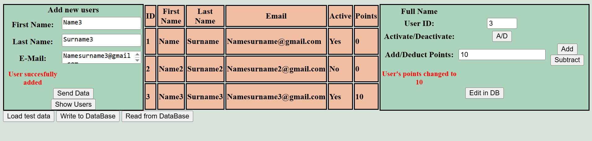

# Point_Management_System
Small full-stack learning project handling user accounts and their loyalty points.

Backend working in pure Java in form of a local HTTP server with simple, intuitive frontend created in HTML, CSS and JS.
Includes handling JSON data via Jackson and storing data in external database, managed by SQL

https://github.com/Mikele97-commits/Point_Management_System

## Features
- User registration with email validation
- Add / subtract / view loyalty points
- Basic activity log per user
- REST endpoints (GET/POST/PUT) for users and points operations
- Data persisted to file using SQL statements (custom lightweight implementation)
- Simple, responsive UI for browsing and managing users/points

## Necessary libraries
-Sqlite-jdbc 3.51.2.0
-Jackson annotations/core/databind 2.21.0
All included in pom.xml (maven is necessary)

## How to Run
1. Compile the files in cmd using "mvn clean compile"
2. Run the server using "mvn compile exec:java"
3. Open index.html using browser of your choice (tested on chrome)

## Screenshots

##What I Learned

-Implementing a basic HTTP server from scratch in Java
-Manual JSON handling & validation
-Simple persistence without ORM
-CORS handling for frontend-backend communication
-Importance of clear API contracts between layers
-Including Maven dependencies, for easier libraries management

Feedback / suggestions welcome!
MIT License
